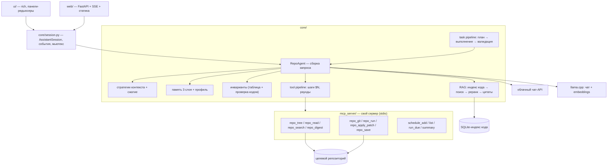

# ff.ai — архитектура

## 1. Что это

Агент-ассистент по разработке в двух режимах: **спросить** (ответ по кодовой базе с цитатами
`file:line`) и **сделать** (задача → план → патчи → детерминированная проверка). Механика
(агент, контекст, память, MCP, RAG, task state, локальная LLM) доменно-нейтральна: предметная
область задаётся **активным доменом** — пакетом данных, поэтому один и тот же ассистент отвечает
и по кодовой базе, и по документации платформы, а смена области не требует правки ядра.

Область применимости задаётся активным доменом (см. `docs/domains.md`). Первый домен —
**разработка приложений под ОС Аврора на Qt 5.6** (`docs/domain-aurora-qt5.md`): C++/QML,
публичные API платформы, `.spec` и RPM, Аврора SDK (`sfdk`, Platform SDK), подпись пакета,
установка и запуск на устройстве или эмуляторе.

## 2. Пять структурных решений

**2.1. Целевой репозиторий — параметр, а не сам инструмент.**
Инструмент запускают из корня произвольного проекта, поэтому «работать в себе» он не может:
состояние инструмента не имеет права попадать в чужой репозиторий. Отсюда разделение:

| Данные | Где лежит | Почему |
|---|---|---|
| Индекс кода | `/path/to/cache/ff-ai/path-hash/index.sqlite3` | производное от содержимого; кэш не засоряет чужой репозиторий |
| История, память, профиль, задачи, расписание, выгрузки | `/path/to/data/ff-ai/` | принадлежит пользователю, а не репозиторию |

**Обозначения путей.** Полные пути конкретной машины в документации не используются — только
относительные пути и шаблоны одного вида, `/path/to/...`: `/path/to/data/ff-ai` — каталог данных
приложения (по умолчанию `$XDG_DATA_HOME/ff-ai`), `/path/to/cache/ff-ai/path-hash` — подкаталог
кэша для целевого репозитория, где `path-hash` — хеш его пути (по умолчанию
`$XDG_CACHE_HOME/ff-ai`). Каждый путь переопределяется переменной `FFAI_*`.

**В целевой репозиторий инструмент не пишет ничего, кроме изменений, которые у него попросили**
(патчи и файлы результатов задачи). Индекс и выгрузки лежат в каталогах состояния: чужой
репозиторий не получает ни `.ffai/`, ни правки `.gitignore` — иначе пришлось бы менять файлы
вне запрошенного изменения (инвариант 3).

Корень выбирается так: `--repo <путь>` → переменная `FFAI_REPO_ROOT` → текущий каталог. Корень
обязан быть git-репозиторием; иначе — явная ошибка старта. Все инструменты записи ограничены
корнем (`path.resolve().is_relative_to(root)`), выход за него — отказ, а не исключение.

**2.2. Фасад сессии отделяет логику от терминала.**
Если оркестрация живёт внутри терминального класса (он владеет агентом, настройками, моделью,
прогоном задачи и сам рисует экран), второй фронтенд заставляет переписывать её заново. Поэтому
оркестрация вынесена в `core/session.py` — `AssistantSession`, единственную точку входа
для обоих интерфейсов:

```python
session.ask(text) -> Answer                      # блокирующая операция, один запрос за вызов
session.run_command(name, args) -> CommandResult # /task, /rag-docs, /tool, /memory, ...
session.start_task() / session.task_step()       # одна операция прогона за вызов
session.report(kind) -> dataclass                # context, usage, memory, task, tool, docs
session.subscribe(listener)                      # события для фронтенда
```

События: `PhaseChanged` (существующий `RequestPhase`-listener), `JournalLine`, `AnswerReady`,
`TaskStateChanged`, `ScheduleAnnounced`. TUI подписывается и печатает; web отдаёт их в SSE.
Фасад сериализует операции мьютексом — «одна операция за раз» уже является контрактом агента
(синхронный блокирующий запрос), так что веб-слой не требует переписывания ядра на async.

**2.3. Два фронтенда, оба — тонкие.**
TUI (`ui/`) — панели-редьюсеры на `keyboard.raw_mode()` и `rich.Live`.
Web (`web/`) — FastAPI + SSE + **одна статическая страница без сборщика** (vanilla JS, vendored
`highlight.js`/дифф-рендерер). Ни node, ни bundler, ни второго языка в стеке: страница
обслуживается тем же процессом, что и TUI, флагом `--web [--web-host/--web-port]`.

**2.4. Домен — данные, а не код.**
Предметная область (сейчас — разработка под ОС Аврора на Qt 5.6) задаётся **пакетом**
`domains/<id>/`: промпты роли и отказа, таблица инвариантов, правила памяти, разделы профиля,
корпуса знаний, белые списки команд и детерминированные проверки. Ядро не содержит ни одного
слова из пакета — это проверяется тестом. Смена или добавление области (Flutter под Аврору, другая
платформа) — добавление каталога, а не правка `core/` и `ui/`. Механизм, раскладка пакета,
выбор домена и чек-лист расширения — `docs/domains.md`; содержание первого пакета —
`docs/domain-aurora-qt5.md`.

**2.5. Знания о платформе приходят из её собственного MCP-сервера.**
Документация Авроры читается не локальной копией PDF, а сервером портала
(`dev-aurora`, remote-транспорт, адрес `https://developer.auroraos.ru/api/mcp`, без токена):
`search` по разделам, `get_document`, `get_doc_versions` для версии, `search_code`/`get_code_source`
для примеров. Отсюда два следствия для кода: реестр серверов перестаёт быть stdio-only
(нужен remote-транспорт в клиенте), а `chunk_id` цитаты становится путём документа портала —
наравне с `path:L10-L40` для кода репозитория.

## 3. Слои



### Поток одного вопроса

1. `AssistantSession.ask` берёт мьютекс и зовёт `RepoAgent.ask`.
2. Агент маршрутизирует реплику по слоям памяти (детерминированная таблица), собирает запрос:
   system → профиль → инварианты → состояние задачи → слои памяти → RAG-фрагменты → результаты
   инструментов → ходы диалога → свежая реплика.
3. Автовызов инструмента (если включён) — отдельный вспомогательный запрос выбора; шаги идут
   через `mcp_server`, результат возвращается одним system-сообщением.
4. Ответ проверяется кодом: инварианты домена и (при непустых источниках, свободный формат)
   обязательные цитаты. Нарушение → один повтор → замена ответа приложения.
5. Только показанный пользователю текст попадает в лог сессии и историю.

## 4. Состав ядра

Ядро не содержит предметных имён: механизмы универсальны, а значения (роль, правила, команды,
корпуса, проверки) приносит пакет домена.

| Слой | Модули | Ответственность |
|---|---|---|
| Конфигурация и пути | `config` | переменные `FFAI_*`, состояние по хешу пути проекта, кэш индекса, прайс моделей, границы настроек |
| Целевой репозиторий | `repo` | выбор корня и границы файловых операций |
| Домен | `domains` | загрузка пакета, проверка схемы, автоопределение, снимок |
| Промпты | `prompts` + `assets/*.md` | роль домена, формат ответа, объём и лимит списка |
| Агент и контекст | `agent`, `context_strategies`, `context_compressor`, `answer_settings` | лог диалога, четыре стратегии, сжатие, потолок токенов, настройки ответа |
| Память и персонализация | `memory_layers`, `long_term_memory`, `user_profile` | три слоя памяти и опросник профиля; таблицы и разделы — из домена |
| Инварианты | `invariants` | проверка ответа по таблице домена, окно отрицания, повтор и замена |
| Задача | `task_state`, `task_pipeline`, `domain_checks`, `patches` | таблица переходов со шлюзом, прогон подзадач, детерминированные проверки, патчи |
| Инструменты и MCP | `mcp_registry`, `mcp_client`, `mcp_tools` | реестр серверов и транспорты, каталог инструментов, выбор моделью, ссылки `$N` и раунды |
| Корпуса, поиск и цитаты | `code_index`, `code_retrieval`, `docs_retrieval`, `reranking`, `embeddings`, `citations` | обход и чанкинг, две ступени отбора, локальные векторы, проверка ссылок и цитат |
| Конвейер операций | `aurora_ops` | шаги сборки, подписи, установки и запуска по данным домена |
| Расход, клиенты и расписание | `usage`, `api_client`, `llama_server`, `schedule_store` | метрики и стоимость, облачный клиент, локальный сервер и embeddings, хранилище планировщика |
| Фасад | `session` | операции, события, мьютекс, снимки-отчёты для интерфейсов |
| Интерфейсы | `ui/*`, `web/*` | панели-редьюсеры и главный цикл; SSE и статика без сборщика |
| Свой сервер | `mcp_server/repo_tools`, `repo_server`, `scheduler` | read-only инструменты репозитория и планировщик отдельным процессом |

## 5. Домен: корпуса, чанкинг, цитаты

Состав корпусов — данные пакета домена (`corpus.json`), механика поиска — общая.

- **Корпус кода**: файлы целевого репозитория с учётом `.gitignore`; исключаются бинарные,
  lock-файлы, vendor/minified и файлы больше порога; плюс проектная документация (`*.md`, спеки).
- **Корпус платформы** (домен Aurora): документация портала через MCP-сервер `dev-aurora` —
  `search` по разделам (`docs`, `qa`, `release_notes`, `articles`, `ext_docs`), полный текст
  `get_document`, версия из `get_doc_versions`. Локальной копии документации нет: сервер портала
  и есть источник истины, поэтому ответы по платформе всегда свежие, но требуют запроса.
- **Стратегии чанкинга** кода (команда `/rag-code compare`): `fixed` (строки с перекрытием),
  `structural` (заголовки Markdown и блоки по отступам/скобкам), `symbol` (tree-sitter —
  опционально, отдельной зависимостью и отдельной фазой).
- **Идентификаторы источников**: код — `chunk_id = path:L10-L40`, `source` — путь относительно
  корня; платформа — `chunk_id` = путь документа портала (`doc/sdk/tools/mb2`), `source` =
  `developer.auroraos.ru`. Оба вида проверяются одинаково: дословный фрагмент ≥
  `MIN_CITATION_CHARS` из **выданного** чанка либо названный идентификатор. Никакой семантической
  проверки: подтверждается ссылка, а не смысл.
- **Embeddings**: по умолчанию локальная embedding-модель через llama-server (хеш-векторы на коде
  дают мусорный поиск [INFERENCE]). Хеш-режим остаётся только как ветка демонстрационного сравнения.
  Документация портала в индекс не кладётся: она читается живым запросом к MCP-серверу.

## 6. Инварианты: базовые и доменные

Базовые инварианты активны всегда и не зависят от домена; их таблица — в коде, на каждое правило
unit-тест. Проверяются **и текст ответа, и аргументы инструментов** (запись файла, команда,
git-операция): запрет срабатывает до действия, а не только после ответа.

| # | Правило | Запрещённые стемы |
|---|---|---|
| 1 | Никаких секретов и ключей в коде, логах и патчах | `sk-`, `api_key=`, `password`, `-----begin`, `*.pem` |
| 2 | Никаких деструктивных git-операций | `--force`, `reset --hard`, `clean -f`, `branch -d` |
| 3 | Не трогать файлы вне запрошенного изменения, включая `.gitignore` | `rm -rf`, `> /`, `chmod 777` |
| 4 | Не «чинить» тесты отключением | `skip`, `xfail`, `--no-verify` |
| 5 | Не выдумывать API и пути: утверждение подтверждается ссылкой | — (промпт + проверка цитат) |

Доменные инварианты (для `aurora-qt5` — десять правил: QtWidgets, только публичные API, только
Qt 5.6, неизменность состава SDK, `.spec`, подпись пакета, разрешения, ключи, `.aurora/`, ссылка
на документацию) лежат в пакете домена: `docs/domain-aurora-qt5.md` §5.

Инварианты старше профиля, памяти и свежей реплики — единственное исключение из правила
«свежая реплика важнее». Текст отказа фиксирован («Не могу предложить…»), нарушение → один повтор
→ замена ответа приложения.

## 7. Безопасность инструментов

Поверхность инструментов — единственный способ агента воздействовать на мир, поэтому она узкая.
Белые списки команд, git-подкоманд и запрещённые команды берутся из пакета домена
(`tools.json`), а не из кода: у `aurora-qt5` это сборка/подпись/проверка пакета и неизменность
состава SDK (`docs/domain-aurora-qt5.md` §6). Домен также приносит свои MCP-серверы — сервер
документации платформы подключается тем же реестром, что и остальные, но по remote-транспорту.

| Инструмент | Ограничение |
|---|---|
| `repo_tree`, `repo_read`, `repo_search` | только внутри корня; лимиты на объём и число результатов |
| `repo_git` | только read-only подкоманды: `log`, `show`, `diff`, `status`, `blame` |
| `repo_run` | белый список подкоманд (`test`, `lint`, `typecheck`), без `shell=True`, таймаут, обрезка вывода, ограниченное окружение |
| `repo_apply_patch` | только внутри корня, только текстовые файлы, сначала дифф на подтверждение |
| `repo_save` | пишет только в каталог выгрузок (`FFAI_EXPORTS_DIR`), не перезаписывает |

Промпт-инъекция из содержимого репозитория считается штатным риском: ассеты объявляют текст
инструментов и файлов данными, инструменты не расширяются текстом задачи, запись требует
подтверждения, инварианты проверяются перед вызовом. Все внешние тексты экранируются в `rich`.

## 8. Сознательные решения, перенесённые без изменений

- Отказ от внегематических вопросов — фраза задаётся промптом, а не фильтром клиента.
- Формат ответа живёт в системном сообщении и защищён STRICT-блоком от переопределения вопросом.
- Лог сессии append-only; стратегии — представление, а не мутатор; `/clear` не трогает долговременную память и профиль.
- Этапы задачи — таблица переходов плюс шлюз с предусловиями; отказ — данные, а не исключение.
- Валидация детерминирована в первую очередь (в ff.ai — прогон тестов и линтера), модельное ревью только дополняет.
- Пустая выжимка/факты — ошибка, а не результат; неудачный вспомогательный запрос не блокирует ответ.
- Метрики (`⏱`) — только для ответа на вопрос; в прогоне задачи расход показывается в панели с метками.
- Состояние — JSON с терпимым чтением; инструкции модели — `assets/*.md`.
